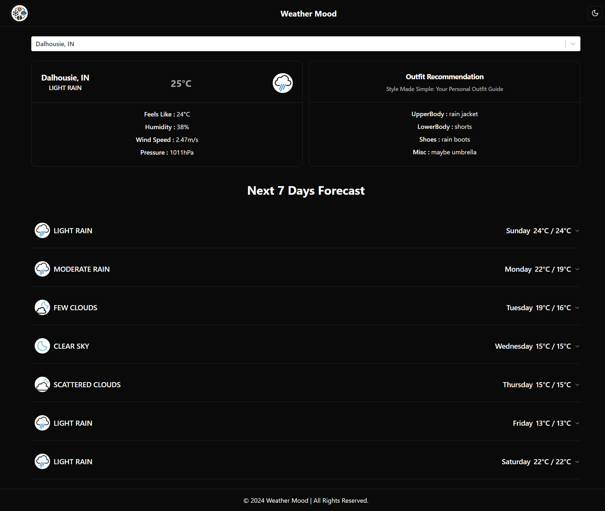

# [Weather Mood]((https://weather-book.netlify.app/))

<div></div>

#### "Weather Mood" is a modern and responsive weather application built with React that provides accurate weather information and forecasts to users. It leverages two APIs - OpenWeatherMap and GeoDB Cities - to fetch real-time weather and location data, respectively.
#### With "Weather Mood", users can easily search for and track the weather in their current location or any location around the world. The app provides detailed weather information such as temperature, humidity, wind speed, and precipitation levels. It also includes a 7-day forecast and displays weather data in an intuitive and visually appealing manner.
#### In addition to providing weather information, Weather Mood also has a unique feature that recommends an outfit based on the current weather. This feature takes into account the temperature, wind, and humidity to provide a suggestion for an outfit that would be comfortable and appropriate for the weather conditions.
#### "Weather Mood" is deployed using Vercel, ensuring fast and reliable performance for users. It's built with a clean and modular codebase, making it easy to maintain and extend with new features.

Try out "Weather Mood" today and stay up-to-date on the weather in your area!

## TechStack Used
- React.js
- javascript
- tailwindcss

## Clone it locally
```
Step 1 : Fork this repository.

Step 2 : git clone `https://github.com/<your-username>/weather-mood`

Step 3 : npm i

Step 4 : create a .env file in the roor and copy the key names from .env.example

Step 5 : npm start
```

`Note : You would need two api keys for this project to work. Link for which you can find in the .env.example file.`
```
VITE_REACT_APP_GEO_API_KEY
# https://rapidapi.com/wirefreethought/api/geodb-cities
```
```
VITE_REACT_APP_OPEN_WEATHER_API_KEY
# https://openweathermap.org/api
```
